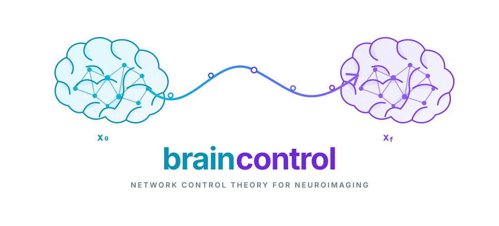

## Installation

Install via `pip install braincontrol`

## State transitions

`braincontrol.transitions` computes requested transitions between states using
Network Control Theory. For tabular input, states are represented by rows and
nodes by columns.

`Transitioner` follows a scikit-learn-style `fit` / `transform` API. Parameters
that define the network and control model are supplied when the estimator is
created. Node information is established during `fit`, while transition-specific
state labels and transition order are supplied during `transform`.

```python
from braincontrol.transitions import Transitioner

transitioner = Transitioner(
    A=adjacency,
    T=1,
    B="identity",
    system="continuous",
)

transitioner.fit(states)  # states: (n_states, n_nodes)

energy = transitioner.transform(
    states,
    order="permutations",
)

errors = transitioner.get_errors()
state_trajectories, control_trajectories = (
    transitioner.get_transition_arrays()
)
```

When fitting and transforming the same states, `fit_transform` can be used
instead:

```python
energy = transitioner.fit_transform(
    states,
    order="permutations",
)
```

`transform` returns a pandas DataFrame with one row per transition and one
column per node.

### Adjacency matrix normalization

By default, `Transitioner` normalizes the adjacency matrix with
`nctpy.utils.matrix_normalization` for the selected time system. The original
validated adjacency matrix is stored as `A_`, while the matrix used for the
control computation is stored as `A_norm_`. The input `A` is not modified.

The normalization constant `c` defaults to `1`:

```python
transitioner = Transitioner(
    A=adjacency,
    T=1,
    system="continuous",
    c=2,
)
```

To provide an adjacency matrix that is already normalized, disable
normalization explicitly:

```python
transitioner = Transitioner(
    A=normalized_adjacency,
    T=1,
    system="continuous",
    normalize_A=False,
)
```

### State input

State input can be supplied as a NumPy array or pandas DataFrame:

```python
energy = transitioner.fit_transform(
    X=states,
    order="permutations",
)
```

For tabular input, `X` must have shape `(n_states, n_nodes)`.

To provide exactly two states, pass the source and target separately. Both
arguments are required, and they cannot be combined with `X`:

```python
energy = transitioner.fit_transform(
    x0=source_state,
    xf=target_state,
    order="permutations",
)
```

`x0` and `xf` can be one-dimensional NumPy arrays or pandas Series. They must
use the same input type and contain the same number of nodes.

The `order` argument determines which transitions are computed:

- `"combinations"` computes each unordered pair once.
- `"permutations"` computes both directions between distinct states.
- `"product"` computes all directed transitions, including self-transitions.
- `"stability"` computes only self-transitions.

`"combinations"` and `"permutations"` require at least two states. `"product"`
and `"stability"` can also be used with a single state.

### Energy type

`energy_type="optimal"` is the default and requires both `rho` and `S`.

Minimal control energy is selected explicitly by setting both optimal-energy
parameters to `None`:

```python
transitioner = Transitioner(
    A=adjacency,
    T=1,
    energy_type="minimal",
    rho=None,
    S=None,
)
```

For minimal energy, `Transitioner` internally resolves these parameters to the
values required by `nctpy`: `rho` is set to a positive solver value and `S` to
a zero matrix.

Mixing `energy_type="minimal"` with a non-`None` `rho` or `S` raises a
`ValueError`. Conversely, optimal energy requires both parameters.

### Reference state

The trajectory reference state `xr` can be `"zero"`, `"x0"`, `"xf"`, or
`"midpoint"`; it defaults to `"xf"`. Because the reference is associated with
the fitted states, pass it to `fit` or `fit_transform`. It can also be a NumPy
vector with one value per network node:

```python
transitioner = Transitioner(
    A=adjacency,
    T=1,
)

transitioner.fit(states, xr=reference_state[:, None])
```

A 3D niimg-like reference can be supplied when a compatible masker is
configured. It is masked to an `(n_nodes, 1)` vector during `fit`:

```python
transitioner = Transitioner(
    A=adjacency,
    T=1,
    masker=masker,
)

transitioner.fit(state_images, xr=reference_image)
```

### Node labels

Node labels are established during `fit` and reused for subsequent calls to
`transform`. If no labels are supplied, tabular input uses the columns of the
resolved state DataFrame.

For plain list-like labels:

```python
transitioner.fit(
    states,
    node_labels=["node_A", "node_B", "node_C"],
)

energy = transitioner.transform(
    states,
    order="permutations",
)
```

The fitted node labels become the columns of the returned energy DataFrame.
Transform input must contain the same number of nodes as the data seen during
`fit`.

For pandas DataFrame input, node labels can be inferred directly from the
columns:

```python
states_df = pd.DataFrame(
    states,
    columns=["node_A", "node_B", "node_C"],
)

transitioner.fit(states_df)
```

An explicitly supplied pandas `MultiIndex` can be used for hierarchical node
metadata. Every MultiIndex level must have a name:

```python
import pandas as pd

node_labels = pd.MultiIndex.from_arrays(
    [
        ["association", "association", "sensory"],
        ["default", "default", "visual"],
        ["A", "B", "C"],
    ],
    names=["cortex", "network", "node"],
)

transitioner.fit(
    states,
    node_labels=node_labels,
)

energy = transitioner.transform(
    states,
    order="permutations",
)
```

The node MultiIndex is preserved as the columns of the returned DataFrame.

### State labels

State labels describe the states supplied to each `transform` call. Unlike node
labels, they are not fixed during `fit`, because different transform calls can
contain different numbers of states.

Plain list-like state labels are converted to an index named `"state"`:

```python
energy = transitioner.transform(
    states,
    state_labels=["rest", "task", "recovery"],
    order="permutations",
)
```

If the transform input is a pandas DataFrame and `state_labels` is not supplied,
the DataFrame index is used instead.

An existing pandas Index preserves its name:

```python
state_labels = pd.Index(
    ["rest", "task", "recovery"],
    name="condition",
)

energy = transitioner.transform(
    states,
    state_labels=state_labels,
    order="permutations",
)
```

A named `MultiIndex` can be used for hierarchical state metadata:

```python
state_labels = pd.MultiIndex.from_arrays(
    [
        ["baseline", "active", "baseline"],
        ["rest", "task", "recovery"],
    ],
    names=["condition", "state"],
)

energy = transitioner.transform(
    states,
    state_labels=state_labels,
    order="permutations",
)
```

Each row of the returned DataFrame represents one transition. For a regular
state Index, each row label is a `(source, target)` tuple. For a MultiIndex,
the original levels and their names are preserved, and each level contains the
corresponding `(source, target)` pair.

For example, the hierarchical labels above can produce transition labels such
as:

```text
condition                 state
(baseline, active)        (rest, task)
(active, baseline)        (task, rest)
...
```

No additional endpoint level is added.

### Neuroimaging input

`Transitioner` also accepts Niimg-like state input when a compatible Nilearn
masker is provided. A 4D image represents multiple states, with one state per
3D volume. A single 3D image is treated as one state.

```python
from nilearn.maskers import NiftiLabelsMasker

transitioner = Transitioner(
    A=adjacency,
    T=1,
    masker=NiftiLabelsMasker(labels_img=atlas),
)

energy = transitioner.fit_transform(
    states_img,
    order="permutations",
)
```

The masker is cloned before fitting so that the user-provided masker instance
is not modified. The fitted masker must expose the node information required by
`Transitioner`.

Two image-like endpoint states can also be supplied separately as `x0` and
`xf`. Each endpoint must contain exactly one state.

### Storing trajectories

State and control trajectories can be retained on the fitted estimator:

```python
transitioner = Transitioner(
    A=adjacency,
    T=1,
    store_state_trajectories=True,
    store_control_trajectories=True,
)

energy = transitioner.fit_transform(
    states,
    order="permutations",
)

state_trajectories, control_trajectories = (
    transitioner.get_transition_arrays()
)
```

Set either storage option to `False` when the corresponding large intermediate
array should not be retained. `get_transition_arrays()` then returns `None` for
that array.

Numerical errors reported by `nctpy` for the most recent transform are
available with:

```python
errors = transitioner.get_errors()
```

### Caching

`Transitioner` inherits Nilearn's `CacheMixin`. Set `memory` to a directory or
a `joblib.Memory` instance to cache the expensive state-transition computation:

```python
transitioner = Transitioner(
    A=adjacency,
    T=1,
    memory="braincontrol_cache",
    memory_level=1,
)
```

Repeated calls with identical adjacency, states, control parameters, and
transition settings reuse the cached computation. Changing any of those inputs
creates a separate cache entry. Caching is disabled by default with
`memory=None`.

For image input, masking can additionally use the caching behavior of the
supplied Nilearn masker.

## Tests

Run the unit suite with:

```bash
python -m pytest -q
```

The empirical neuroimaging tests download Nilearn and ENIGMA data and are
therefore opt-in:

```bash
BRAINCONTROL_RUN_NEUROIMAGING_TESTS=1 \
python -m pytest -m integration tests/test_transitions_neuroimaging_data.py
```
