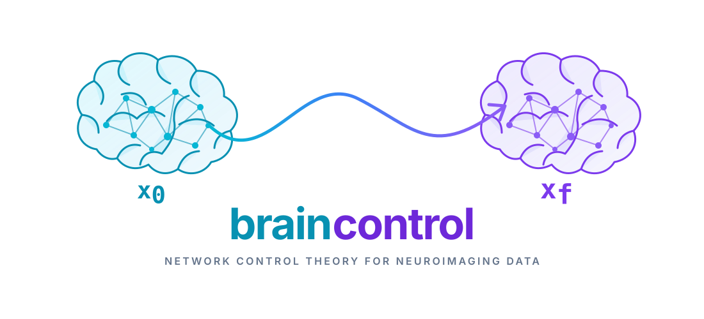

# braincontrol

`braincontrol` provides Network Control Theory (NCT) tools for
neuroimaging data. Its main estimator, `Transitioner`, computes
node-level control energy for transitions between brain states using the
[nctpy](https://github.com/LindenParkesLab/nctpy) package, with support for NumPy, pandas, and Niimg-like state inputs.

## Installation

``` bash
pip install braincontrol
```

`braincontrol` requires Python 3.9 or newer.

## Quick start

`Transitioner` follows a scikit-learn-style `fit` / `transform`
workflow. Estimator parameters such as the time horizon and transition
strategy are configured when the estimator is created. Empirical
matrices and states are supplied to `fit`, `transform`, or
`fit_transform`.

``` python
import numpy as np

from braincontrol.transitions import Transitioner

# Example network with three nodes.
A = np.array([
    [0.0, 0.4, 0.2],
    [0.4, 0.0, 0.3],
    [0.2, 0.3, 0.0],
])

# Rows are states, columns are nodes.
X = np.array([
    [1.0, 0.0, 0.0],
    [0.0, 1.0, 0.0],
    [0.0, 0.0, 1.0],
])

transitioner = Transitioner(
    T=1.0,
    transitions="directed",
)

energy = transitioner.fit_transform(
    A=A,
    X=X,
)

print(energy)
```

For unlabeled NumPy input, the returned energy has shape
`(n_transitions, n_nodes)`. If node or state labels are available,
`Transitioner` preserves them in a pandas `DataFrame`.

## Development

Install the development dependencies and run the test suite with:

``` bash
python -m pytest -q
```

## License

`braincontrol` is distributed under the MIT License.
